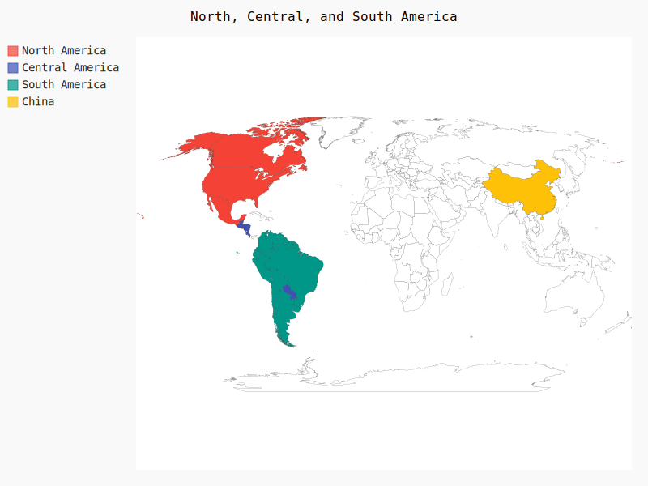
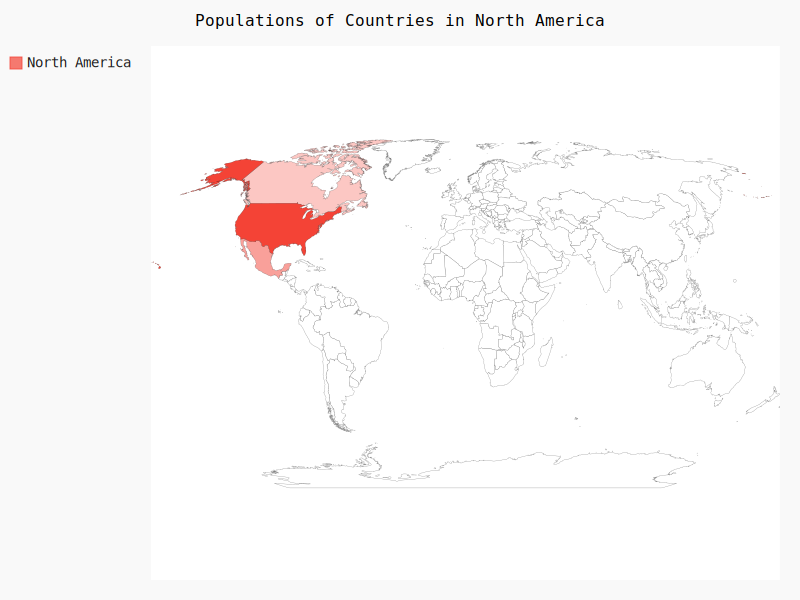
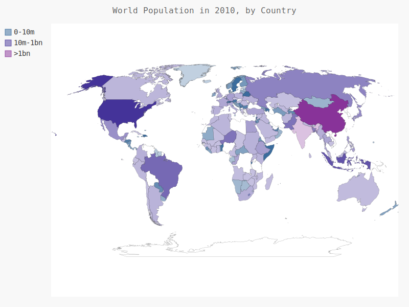

# 制作世界人口地图：JSON格式

> ## 下载JSON格式的人口数据，并使用json模块来处理它们

* **下载世界人口数据从[http://data.okfn.org/](http://data.okfn.org/)下载**

---
> ## 文件说明

* ## countries.py

  * **输出所有的国别码**

* ## countries_code.py

  * **包含一个根据制定国家，返回对应的国别码**
  * 模块名： _get_country_code(country_name)_

* ## americas.py

  * **创建一个突出北美、中美和南美的简单地图**

    

* ## na_populations.py

  * **在世界地图上呈现数字数据**

    

* ## world_population.py

  * **处理数据，绘制完整的世界人口地图**

    
