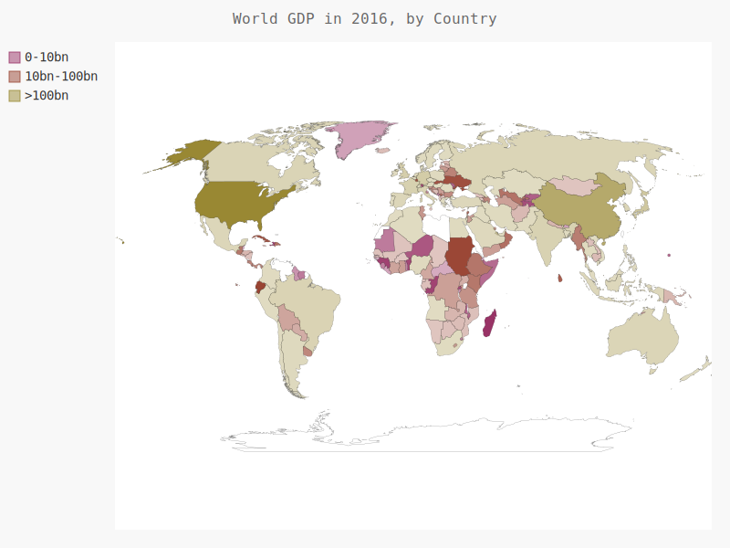

# 制作世界信息统计地图：JSON格式

> ## 下载JSON格式的人口数据，并使用json模块来处理它们

* **下载世界人口数据从[http://data.okfn.org/](http://data.okfn.org/)下载**

---
> ## 文件说明

* ## countries.py
  * **输出所有的国别码**
* ## countries_code.py
  * **包含一个根据制定国家，返回对应的国别码**
  * 模块名： _get_country_code(country_name)_
* ## americas.py
  * **创建一个突出北美、中美和南美的简单地图**

    

* ## na_populations.py
  * **在世界地图上呈现数字数据**

    

* ## world_population.py
  * **处理数据，绘制完整的世界人口地图**

    

* ## GDP相关处理文件
  * **gdp_create_makdown.py** *创建预览一系列GDP数据的md文件*
  * **gdp_world.py** *绘制GDP信息地图主文件*
  * **get_country_code_three_or_two.py** *处理ISO_3166-1.json文件信息，返回相应的数据信息*
    * **包含如下两个方法**：
    * **get_two_country_code()** *根据三位国家简写码返回两位国家简写码*
    * **show_all_country_code()** *显示ISO_3166-1.json文件信息*
  * **ISO_3166_to_JSON.py** *用于将CSV格式的世界GDP数据文件转换为json格式的文件*
  * **处理世界GDP信息数据，绘制完整的世界GDP信息地图**

    
