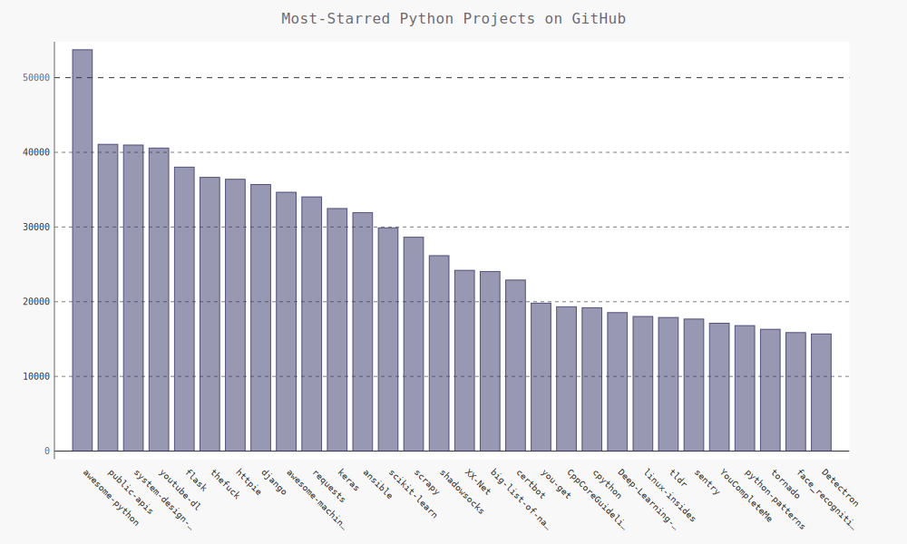

# 使用API，Web应用编程接口（API）

> ## 使用Web API
> Web API是网站的一部分，用于与使用非常具体的URL请求特定信息的程序交互。
> 这种请求称为API调用。请求的数据以（JSON或CSV）返回。
* Git和GitHub
  * 使用API调用请求数据，GitHub的API使我们能够通过API调用来请求各种信息
  * 想知道API调用是什么样的，请在浏览器地址栏中输入如下网址并按回车键

    ```json
    https://api.github.com/search/repositories?q=language:python&sort=stars

    // 以下是以上的API返回的头几行数据
    {
    "total_count": 2888187, // 这里显示的是GitHub目前共有的Python项目
    "incomplete_results": false, // 这里的false告诉我们请求时成功的，数据完整
    "items": [ //这里开始就是包含GitHub上最受欢迎的Python项目的详细信息
      {
        "id": 21289110,
        "node_id": "MDEwOlJlcG9zaXRvcnkyMTI4OTExMA==",
        "name": "awesome-python",
        "full_name": "vinta/awesome-python",
        --snip--
    ```
* **requests** 包
  * requests包让Python程序能够轻松地向网站请求信息以及检查返回相应。
* **python_repos.py**
  * 处理API响应
  * 处理响应字典
  * 监视API的速率限制
    ```json
    https://api.github.com/rate_limit

    // 以下是网站返回的信息
    {
      "resources": {
        "core": {
          "limit": 60,
          "remaining": 60,
          "reset": 1533994741
        },
        "search": {
          "limit": 10,  // 速率限制，极限每分钟10个请求
          "remaining": 10,  // 当前1分钟内还能执行的请求
          "reset": 1533991201 // 这里指的是配额将重置的Unix时间或新纪元时间（1970年1月1日午夜后多少秒
        },
        "graphql": {
          "limit": 0,
          "remaining": 0,
          "reset": 1533994741
        }
      },
      "rate": {
        "limit": 60,
        "remaining": 60,
        "reset": 1533994741
      }
    }
    ```
  * 使用获取的数据信息进行数据可视化，如下图
    
